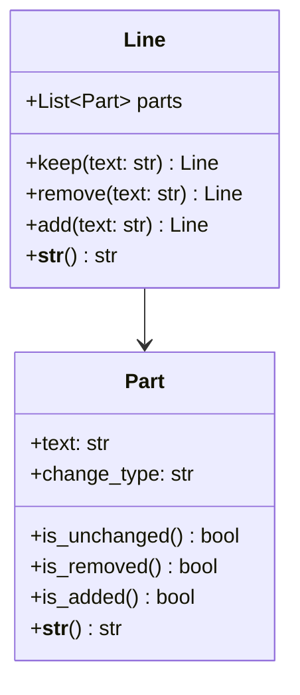

You are an expert in python.

# Process

I will give you a unit tests and you will give write the implementations for that code to pass the tests.
just show me the code, no explanations

# Next Steps
If this makes sense please respond with `show me the code`

