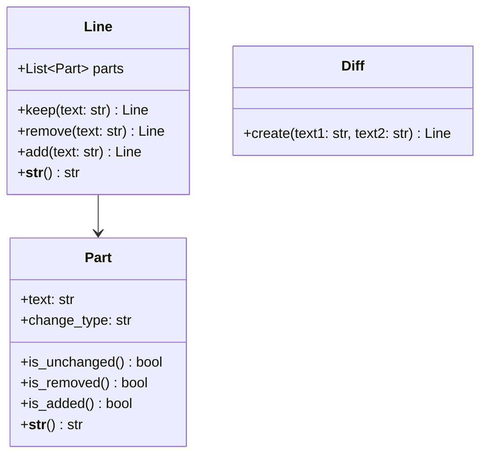

```mermaid
classDiagram
    class Part {
        +text: str
        +change_type: str
        +is_unchanged() bool
        +is_removed() bool
        +is_added() bool
        +__str__() str
    }

    class Line {
        +List~Part~ parts
        +keep(text: str) Line
        +remove(text: str) Line
        +add(text: str) Line
        +__str__() str
    }

    class Diff {
        +create(text1: str, text2: str) Line
    }

    Line --> Part

```